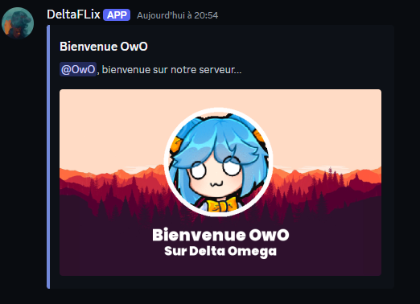
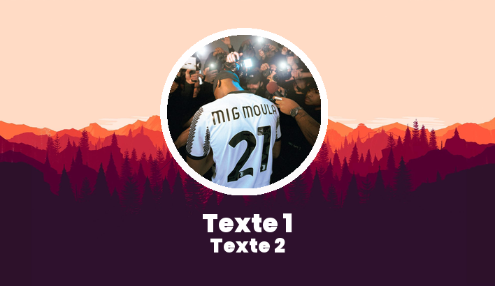

# 👋 Welcome Card


### Paramètres :

| Nom        | Description              | Valeur par défaut |
| ---------- | ------------------------ | ----------------- |
| background | L'url de l'arrière plan  | None              |
| avatar     | L'url de l'avatar        | None              |
| text1      | Le texte du titre        | None              |
| text2      | Le texte du sous-titre   | None              |


### Exemple d'utilisation dans une cog d'un bot py-cord :


```python
import discord
from discord.ext import commands
import requests

# Initialisation de la cog
class Welcome(commands.Cog):
    def __init__(self, bot):
        self.bot = bot
    
    @commands.Cog.listener()
    async def on_member_join(self, member):
        
        # Initialisation des variables
        username = member.display_name
        avatar_url = member.avatar.url
        background_url = "https://wallpapercave.com/wp/wp7240372.jpg"
        user_mention = member.mention
        
        # Création de l'embed
        embed = discord.Embed(
            title=f"Bienvenue {username}",
            description=f"{user_mention}, bienvenue sur notre serveur...",
            color=0x7289da
        )

        # Initialisation de l'url
        url = f"https://api-octopia.vercel.app/json/welcome?text1=Bienvenue {username}&text2=Sur Delta Omega&background={background_url}&avatar={avatar_url}"
        
        # Formattage des espaces (optionnel)
        url = url.replace(" ", "%20")

        # Récupération de l'image
        r = requests.get(url)
        data = r.json()
        url = data["image_url"]

        # Ajout de l'image dans l'embed
        embed.set_image(url=url)
        
        # Récupération du salon de bienvenue
        salon_bienvenue_id = 1246501813684015124
        guild = member.guild
        salon_bienvenue = guild.get_channel(salon_bienvenue_id)
        
        # Envoi de l'embed de bienvenue
        await salon_bienvenue.send(embed=embed)
        
# Ajout de la cog (ne pas oublier de rajouter l'extension dans le fichier principal du bot)
def setup(bot):
    bot.add_cog(Welcome(bot))
```


### Résultat :

<figure><figcaption></figcaption></figure>

### Utilisation directement dans le lien (json)  :


```
https://api-octopia.vercel.app/json/welcome?text1=Texte 1&text2=Texte 2&background=https://wallpapercave.com/wp/wp7240372.jpg&avatar=https://cdn.discordapp.com/avatars/1165639346104303739/cc261689fad84e2c14261633ce8f6901.png?size=512
```


### Json renvoyé par le lien :


```json
{
    "image_url": "https://res.cloudinary.com/dkxttgz7x/image/upload/v1717873503/welcome_images/knwvrbjyogjvctkeejiu.png"
}
```

### Utilisation directement dans le lien (image)  :


```
https://api-octopia.vercel.app/welcome?text1=Texte 1&text2=Texte 2&background=https://wallpapercave.com/wp/wp7240372.jpg&avatar=https://cdn.discordapp.com/avatars/1165639346104303739/cc261689fad84e2c14261633ce8f6901.png?size=512
```


### Image renvoyée par le lien :

<figure><figcaption></figcaption></figure>
